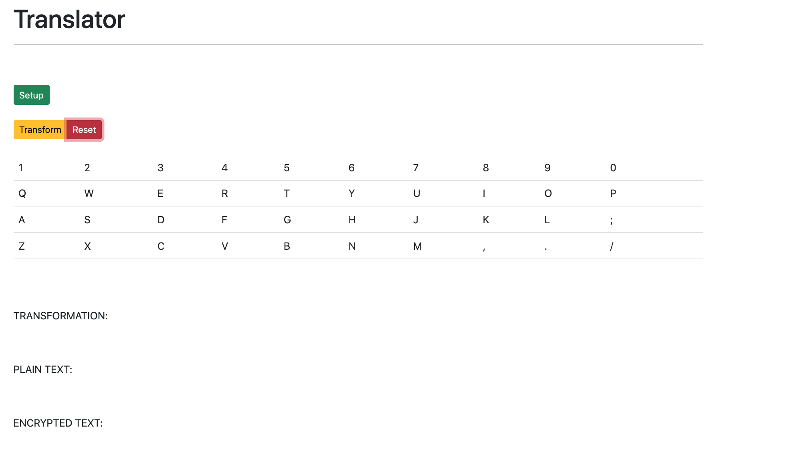

# About

This project started as a coding challenge -- To remap a keyboard according to a transformation string. For example, one possible set of transformations could be a vertical flip, a horizontal flip, and a horizontal shift by N units, denoted by V, H, and S(N) respectively. With these atomic operations, you should be able to create a string that represents a sequence of transformations. For example "S3HV" represents a horizontal shift to the right three units, followed by a horizontal flip, finished by a vertical flip. After this transformation, the key on a keyboard that would usually have 'a' mapped to it, would now have 'k' mapped (assuming a keyboard limited to 10 keys per row starting from q, a, and z).

Then I wanted to learn VueJS and how to make an API. I figured I'd learn by creating this web app as an interface which communicates to the keyboard transformer described above on a backend connected via an API.

# Setup

1. cd into the server directory

> cd server

2. make sure you have flask, flask_cors, and numpy installed, preferably in a virtual environment.

> pip install flask
>
> pip install flask_cors
>
> pip install numpy

3. launch the server

> python app.py

4. open a new terminal window at the project root and head over to the client directory

> cd client

5. make sure you have all the node dependencies installed

> npm install

6. start up the front-end server

> npm run serve

At this point the you should be able to open your brower and direct it to http://localhost:8080/ and see the running web app.

# Usage

At initialization the web app will look like this --

Click "Setup" and input a word you want to transform along with a transformation string as shown below.

Hit submit, then click transform and watch the keyboard remap itself through each successive transformation live. Once there are no more tranformations left, a "finished" banner will appear.

Rinse and repeat.

# Thank you!

Thanks for looking at my humble project. It was a great learning experience for many practical coding skills.

